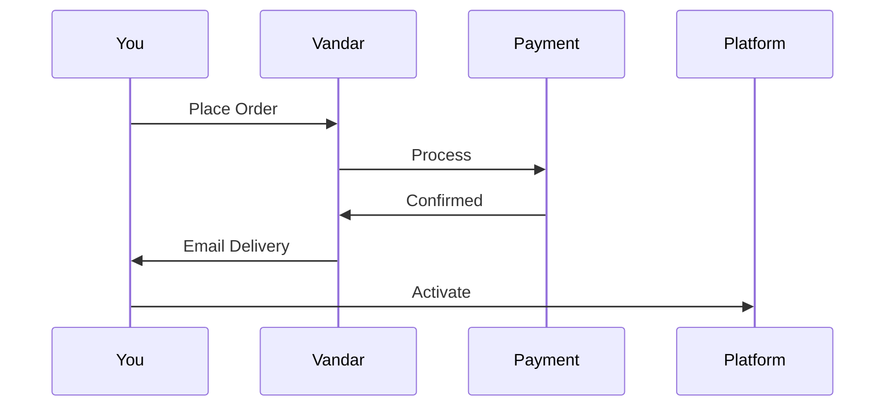

## Overview

Vandar provides a streamlined digital marketplace for gamers and software users in Saudi Arabia. You access premium game accounts, activation keys, and digital codes with instant delivery, competitive discounts, and secure transactions. Simplify your digital purchases through categories like PC games and software licenses.

<Callout kind="info">
Vandar emphasizes speed, security, and ease, delivering products like Steam accounts and Windows keys directly to your inbox.
</Callout>

## Key Product Categories

Discover Vandar's main offerings through these core categories. Each supports instant access and reliable activation.

<Columns cols={3}>
  <Card title="Game Accounts" icon="gamepad-2" href="https://vandarstore.com/ar/games">
    Purchase shared or dedicated Steam, Epic, and Battle.net accounts for titles like Elden Ring and ARK Survival Evolved.
  </Card>
  <Card title="Software Keys" icon="key" href="https://vandarstore.com/ar/software">
    Get activation keys for Windows, Office, and antivirus software with guaranteed legitimacy.
  </Card>
  <Card title="Game Codes" icon="gift" href="https://vandarstore.com/ar/codes">
    Redeemable codes for expansions like Shadow of the Erdtree or full games like EA Sports FC.
  </Card>
</Columns>

## Best-Sellers and Discounts

Vandar highlights top-selling items with significant savings. Browse these popular products featuring up to 70% off.

| Product | Platform | Discount | Price (SAR) |
|---------|----------|----------|-------------|
| Elden Ring: Shadow of the Erdtree | PC (Steam) | 96% | 12.78 |
| ARK Survival Evolved Standard | PC (Steam) | 49% | 16.78 |
| EA Sports FC 26 Ultimate | PC (Steam) | 50% | 189.78 |
| Ghost of Tsushima Director's Cut | PC (Steam) | 51% | Varies |

<Callout kind="success" title="Discount Tip">
Check the "Most Sold" section on Vandar for real-time deals and limited-time offers.
</Callout>

## Secure Payment Options

Vandar supports multiple trusted payment methods tailored for Saudi users.

<Tabs>
  <Tab title="Mada" icon="credit-card">
    Use Mada debit cards for instant processing and local currency transactions.
  </Tab>
  <Tab title="Apple Pay" icon="apple">
    Pay securely via Apple Pay with biometric authentication.
  </Tab>
  <Tab title="STC Pay" icon="phone">
    Link your STC Pay wallet for quick mobile payments without sharing card details.
  </Tab>
</Tabs>

All payments use SSL encryption and fraud detection to protect your information.

## Automated Delivery Process

Experience seamless delivery from purchase to activation.

<Steps>
  <Step title="Browse & Buy" icon="search">
    Select your game account or key and complete payment.
  </Step>
  <Step title="Instant Email" icon="mail">
    Receive delivery details within seconds via email.
  </Step>
  <Step title="Activate" icon="check-circle">
    Log in to Steam or Microsoft and activate your product.
  </Step>
  <Step title="Support" icon="headphones">
    Access 24/7 chat if needed.
  </Step>
</Steps>

## Advanced Use Cases

<ExpandableGroup>
  <Expandable title="Bulk Purchases for Teams" default-open="true">
    Buy multiple game accounts at discounted rates for gaming teams or events. Contact support for volume pricing.
  </Expandable>
  <Expandable title="Software Subscriptions">
    Renew Windows or Office keys automatically with recurring options.
  </Expandable>
</ExpandableGroup>

Start shopping securely today and enjoy Vandar's full range of digital products.